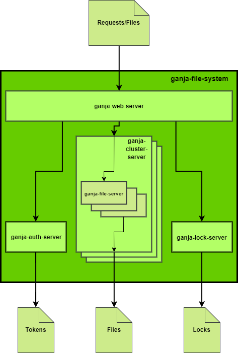

# Ganja File System (CS4400 Individual Project Task)
### By Jerico Alcaras, 14317110
## Run using NPM
This service requires **Node** and **NPM** in order to run (built and tested using Node 8.2.1 and NPM 5.5.1).
### Windows
1. Clone the repository.
2. Run `start-win.bat`. This runs all the servers by executing their respective `npm start` scripts (make sure your Node installation is at C:/Program Files/nodejs). Five command prompts should appear and start installing Node modules, then start instances of each server.
3. Connect to `localhost:8080` and use the routes as described at https://github.com/alcarasj/ganja-file-system#api.
### Linux/Mac
Tested on Ubuntu 16.04 (might not work on Mac, sorry).
1. Clone the repository.
2. Open a terminal and `cd` to the repository.
3. `chmod +x *.sh`
4. `./start-unix.sh`
5. Connect to `localhost:8080` and use the routes as described at https://github.com/alcarasj/ganja-file-system#api.
### Terminal
If the above methods do not work, try the manual method.
1. Open a terminal and `cd` to the repository.
2. `cd` to `ganja-file-server`.
3. `npm start`
4. Repeat steps 1 to 3 for all the other servers.
### Scripts
* To delete all the data in the file system: `delete-all-data-win.bat` (Windows) or `delete-all-data-unix.sh` (Linux/Mac).
* To remove Node modules in all servers (use this if servers fail to start): `clean-win.bat` (Windows) or `clean-unix.sh` (Linux/Mac).
## Architecture
### Overview
* All servers use the Express framework (https://www.npmjs.com/package/express).
* `ganja-web-server` acts as a client proxy that sends/redirects requests to all other servers. It also performs error handling.
* The file system is purely a back-end, RESTful service that uses HTTP and JSON, and can be easily attached to a front-end application or be used out-of-the-box.
* The file system is a single instance that is accessed by all users, meaning that all files stored in the system can be accessed by all users.
* Another layer of abstraction can be added above the `ganja-file-system` level to support multiple instances of `ganja-file-system` (yes, `ganja-file-system` is a 420-friendly, stone-age Google Drive).
### Diagram

## Features
### Distributed Transparent File Access
* Upload (with overwrite option), delete and download system.
* All files are uniquely identified by their name.
* Files are stored by instances of `ganja-file-server` in their respective `data` folders.
* `ganja-web-server` handles all use cases and serves as a client proxy.
### Security Service
* Authentication and authorization, provided by `ganja-auth-server` using JWT (https://www.npmjs.com/package/jsonwebtoken).
* On successful login, a JSON web token is returned that must be used in the `x-access-token` header for every HTTP request sent to all routes.
### Directory Service
* Flat file system, each successfully uploaded file will have the IP address of a `ganja-file-server` associated with it.
* Implemented at the `ganja-cluster-server` level using local SQLite databases.
### Replication
* `ganja-web-server` is connected to multiple instances of `ganja-cluster-server`, and each `ganja-cluster-server` is connected to multiple instances of `ganja-file-server`.
* Files are replicated (uploaded, overwritten and deleted) across all clusters.
* File downloads are served via round-robin on instances of `ganja-cluster-server` as a naive form of load-balancing.
### Caching
* Caching is implemented at the `ganja-web-server` level using Cacheman (https://www.npmjs.com/package/cacheman).
* Every upload is cached for faster download, with a TTL of 5 minutes.
* This means that the most frequently modified files are cached for a faster download-then-overwrite use case.
* This allows users to have access to the latest version of a file as soon as it is uploaded.
### Transactions
* If implemented, a transaction service would be placed at the `ganja-web-server` and `ganja-cluster-server` levels for upload, overwrite and delete routes.
* All upload, overwrite and delete requests would be written to a spool-file (a .txt file, one entry per line) and files (stored in a folder named by hash-value) stored in the `tmp` folder.
* Since all files are replicated across all clusters, then these routes will have an entry in the spool-file for each cluster.
* A spool-file entry and their associated file are to be deleted once a success response is received from the entry's designated recipient server.
* If transactions are not completed when there is a server failure, the sender server will read the spool-file on start-up (if it fails itself) or time-out (if a recipient server fails), and re-send the request.
### Lock Service
* Lock-lease system, provided by `ganja-lock-server`, implemented using a key-value, cache-style system with TTL using Cacheman (https://www.npmjs.com/package/cacheman).
* The user who has a lock on a file can modify it. Other users cannot modify it until this lock expires.
* A lock request can have a user-defined lock time.
* Maximum lock time is 24 hours.
* Default lock time is 60 seconds if a lock time is not provided by the user.
## API
* All requests must be sent to `ganja-web-server`.
* All routes have been tested using Postman (https://www.getpostman.com/).
* All routes accept HTTP requests with a JSON body. Required fields are marked with a `*`.
* All routes will return a JSON response body containing `success`:`boolean` and `message`:`string` (along with the rest of the data) to indicate whether or not the operation was performed successfully. The `message` will also help the user to identify errors.
* All routes except `/login` and `/register` will require a `token` string to be passed in the user's `x-access-token` request header for authorization.
* `FILE_NAME` is the URI-encoded string of a file's name.

|Route|Type|Description|Request Body|Response Body|
|----|---|----|----|----|
| `/login` |POST (urlencoded)|User login. Returns a token for use on all routes.|`email*`:`string`, `password*`:`string`|`token`:`string`|
| `/register` |POST (urlencoded)|User registration.|`email*`:`string`, `password*`:`string`|-|
| `/upload` |POST (form-data)|Uploads one file to the system, with option to overwrite if file already exists, and option to make file lockable or not.|`file*`:`File`, `overwrite*`:`bool`, `lockable*`:`bool`|-|
| `/files` |GET|Lists all files that are currently in the system.|-|`files[]`:`{ fileName: string, lockable: boolean }`|
| `/files/FILE_NAME` |GET|Downloads a file from the system, specified by `FILE_NAME`.|-|`file`:`File`|
| `/files/FILE_NAME` |DELETE|Deletes a file from the system, specified by `FILE_NAME`.|-|-|
| `/lock` |GET|Locks a lockable file in the system for the user, with option for a user-specified lock time in seconds (default is 60 if not specified, max is 86400).|`fileName*`:`string`, `lockTime`:`int`|-|
| `/unlock` |GET|Unlocks a file that was locked by the same user.|`fileName*`:`string`|-|
| `/checkForLock` |GET|Checks if a file is currently locked. The `modify` response field indicates whether the file can be modified by the user (this is used for deletion and overwriting).|`fileName*`:`string`|`locked`:`boolean`, `modify`:`boolean`|
